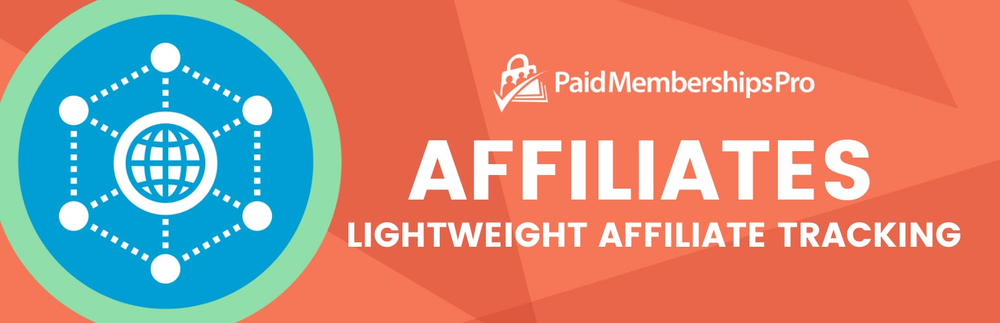

# [Paid Memberships Pro - Affiliates](https://www.paidmembershipspro.com/add-ons/pmpro-lightweight-affiliate-tracking/) #
[comment]: # (Generate badges from shields.io, only works for .org plugins to get other stats etc. We'd have to create our own endpoints for Premium plugins)

### Welcome to the Paid Memberships Pro - Affiliates GitHub Repository

The Lightweight Affiliate Tracking Add On for Paid Memberships Pro creates unique affiliate codes assigned to your affiliate users. When someone visits your site using an affiliate URL (a code is passed to a page as a parameter), the affiliate's cookie is set for the specified number of days. If a cookie containing an affiliate referral code is present after checkout, the order is logged in the affiliate's account.

Affiliates can see a report of their activity by creating a page (optional) with the shortcode [pmpro_affiliates_report]. The admin can view a report of affiliate activity in the admin under Memberships > Affiliates as well as add and manage affiliate codes.

For more information please visit [the Add On documentation page for this plugin](https://www.paidmembershipspro.com/add-ons/pmpro-lightweight-affiliate-tracking/).

## Installation ##
For detailed installation steps, visit the [documentation](https://www.paidmembershipspro.com/add-ons/pmpro-lightweight-affiliate-tracking/) page.

1. Download the current development ZIP file directly: `https://github.com/strangerstudios/pmpro-affiliates/archive/dev.zip`

**Please ensure that once installing this version of the plugin to remove `-dev` from the plugin's folder name.**

## Bugs ##
If you find an issue/bug, let us know by [creating a detailed GitHub issue](https://github.com/strangerstudios/pmpro-affiliates/issues/new/choose).

## Support ##
This is a developer's portal for Paid Memberships Pro - Affiliates. We do not offer support on this channel. **Any support related questions should be directed to [our website](https://www.paidmembershipspro.com/add-ons/pmpro-lightweight-affiliate-tracking/).**

## Contributing to Paid Memberships Pro - Affiliates ##
We encourage and welcome any contribution to Paid Memberships Pro - Affiliates. Please read the [guidelines for contributing](https://github.com/strangerstudios/pmpro-affiliates/blob/dev/.github/CONTRIBUTING.md) to this repository.

There are various **ways to the help development** of Paid Memberships Pro - Affiliates:

1. Report [bugs/issues](https://github.com/strangerstudios/pmpro-affiliates/issues/new/choose) on GitHub.
2. Work on any issues by submitting a Pull Request.

Here are some ways for **non-developers to contribute** to Paid Memberships Pro - Affiliates:

1. Translate Paid Memberships Pro - Affiliates into your own [language](https://www.paidmembershipspro.com/paid-memberships-pro-in-your-language/).
2. [Purchase a Plus membership](https://paidmembershipspro.com/pricing) to help fund ongoing development and bug fixes.
